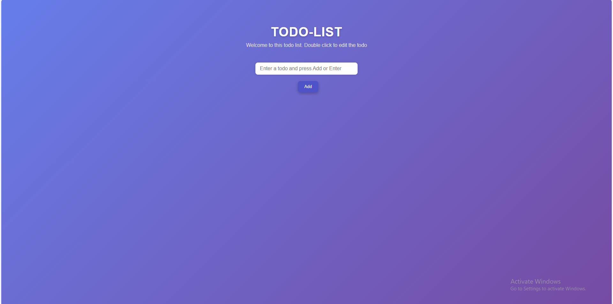

# 📝 Todo List – Interactive Task Manager

## 📌 Project Overview

This project is a fully responsive and interactive **Todo List application** built using **HTML, CSS, and JavaScript**.

It allows users to add, edit, complete, and delete tasks with persistent data storage using Local Storage.

The goal of this project was to practice DOM manipulation, event handling, and frontend UI design principles.

---

## 🚀 Live Demo

🔗 https://mayuresh-2601.github.io/Todo-List/

---

## 🎯 Key Features

✔ Add new tasks  
✔ Mark tasks as completed  
✔ Delete tasks  
✔ Double-click to edit tasks  
✔ Persistent storage using Local Storage  
✔ Smooth animations  
✔ Responsive design  
✔ Modern glassmorphism UI  

---

## 🛠️ Technologies Used

- HTML5 (Semantic structure)
- CSS3 (Flexbox, Animations, Media Queries)
- JavaScript (DOM Manipulation, Event Handling)
- Local Storage API

---

## 📂 Project Structure

Todo-List/
│
├── index.html
├── style.css
├── script.js

---

## 🧠 JavaScript Functionalities Implemented

### ➕ Add Task
- Detects input value
- Adds task on button click
- Adds task on Enter key press

### ✅ Complete Task
- Checkbox toggles completion
- Applies strike-through effect
- Updates Local Storage

### ✏ Edit Task
- Double-click to edit
- Updates DOM dynamically
- Saves changes instantly

### ❌ Delete Task
- Removes task from array
- Re-renders UI
- Updates Local Storage

### 💾 Local Storage
- Saves tasks automatically
- Loads tasks on page refresh

---

## 📊 UI & UX Highlights

- Clean and modern gradient background
- Glassmorphism task container
- Smooth fade-in animation
- Hover effects on buttons
- Responsive layout (Mobile-friendly)
- Visual feedback for completed tasks

---

## 📈 What I Learned

- Advanced DOM manipulation
- Working with arrays and objects
- Event-driven programming
- Local Storage implementation
- UI design principles
- Git & GitHub workflow
- Project deployment using GitHub Pages

---

## 🚀 How to Run This Project Locally

1. Clone this repository:
git clone https://github.com/mayuresh-2601/Todo-List.git

2. Open the project folder
3. Open `index.html` in your browser

No backend or dependencies required.

---

## 👨‍💻 Author

**Mayuresh Kasar**  
Frontend Developer | Web Development Enthusiast  

GitHub: https://github.com/mayuresh-2601  

---

## ⭐ Support

If you like this project, consider giving it a ⭐ on GitHub!